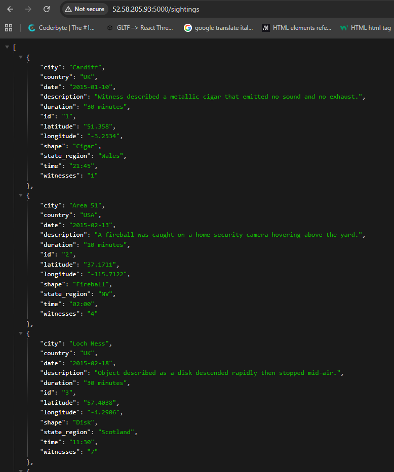

# UFO Sightings Flask API — EC2 Deployment

A simple Flask application that serves UFO sighting records from a CSV dataset as JSON, deployed on an AWS EC2 instance.

## Endpoints

| Endpoint | Method | Description |
|---|---|---|
| `/` | GET | Returns a "Hello World!" message |
| `/json` | GET | Returns a sample JSON payload |
| `/sightings` | GET | Returns all UFO sighting records |
| `/sightings/<id>` | GET | Returns a single sighting by numeric ID |

## Deployment Steps

### 1. Launch and update the EC2 instance

Launch an EC2 instance (Ubuntu), then SSH in and update it:

```bash
sudo apt update
sudo apt upgrade -y
```

### 2. Clone the repository

```bash
git clone https://github.com/mjc-237/ufo_sightings.git
cd ufo_sightings
```

> Note: if the repo is private, you'll need to generate an SSH key pair on the instance with `ssh-keygen` and add the public key to your GitHub account before cloning. Making the repo public avoids this step entirely.

### 3. Install the virtual environment tool

```bash
sudo apt install python3.14-venv -y
```

### 4. Create and activate a virtual environment

```bash
python3 -m venv venv
source venv/bin/activate
```

### 5. Install dependencies

```bash
pip install flask
```

### 6. Update the app to listen on all interfaces

In `basic_app.py`, the `app.run()` call was updated to bind to `0.0.0.0` so the app is reachable from outside the instance, not just `localhost`:

```python
app.run(host='0.0.0.0', debug=True)
```

### 7. Run the application

```bash
python basic_app.py
```

The app will start on port `5000`.

### 8. Open port 5000 in the Security Group

In the EC2 console, edit the instance's Security Group to add an **Inbound Rule**:


### 9. Access the app

## Evidence

Screenshot of the `/sightings` endpoint running successfully in the cloud:



## Repository

`https://github.com/mjc-237/ufo_sightings`http://52.58.205.93:5000/sightings
```

With the app running and the port open, visit the following in a browser (replace with your instance's public IP):

```
- Type: Custom TCP
- Port: 5000
- Source: 0.0.0.0/0

